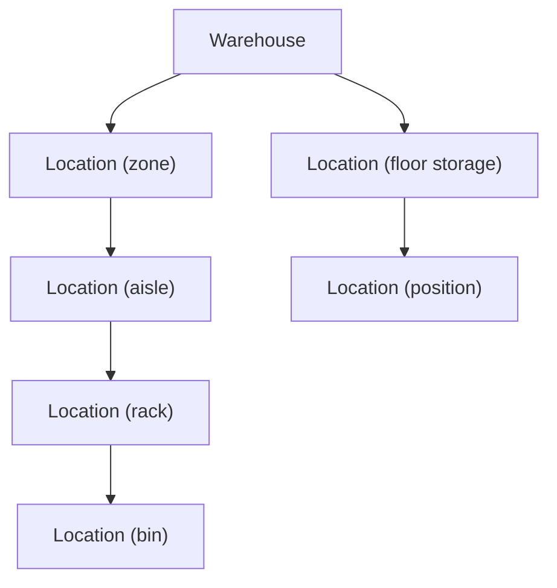

# Facility / Location Model

> Fiziksel dünyanın modeli. Facility modülü "nereler var?" sorusuna cevap verir;
> "ne kadar var?" sorusuna cevap vermez (o Inventory'nin işidir).

## Temel Karar: Generic Hiyerarşik Location (ADR-0002)

Her depo farklı fiziksel topolojiye sahiptir. Rigid `Warehouse→Zone→Aisle→Rack→Level→Bin`
zinciri kurmuyoruz. Bunun yerine:



- `Location.ParentLocationId` → aynı warehouse'daki üst location (kök → `Warehouse`).
- Derinlik sınırı yok; her depo kendi ağacını kurar.
- İlişkiler **entity ilişkileriyle** tutulur — `Location.Code` string'ini parse ederek
  aisle/rack çıkarmak YASAKTIR (anti-pattern). `Code` yalnızca insan okur tanımlayıcıdır.

## Varlıklar

### Warehouse (Company scope)

```text
Warehouse
  Id, Code (şirkette unique), Name
  Address / Geo (enlem-boylam)      → sourcing mesafeleri için
  IsActive, TimeZone                → cutoff/operasyon saatleri (ileride)
```

### Location (Warehouse scope)

```text
Location
  Id
  WarehouseId                       → HER location bir depoya aittir (zorunlu)
  ParentLocationId                  → aynı WarehouseId'de olmak zorunda (nullable = kök)

  Code                              → (WarehouseId, Code) UNIQUE — DB constraint
  Name
  LocationType                      → enum (aşağıda)

  IsActive, IsBlocked               → blokaj operasyonları durdurur, geçmiş korunur

  AllowsPicking
  AllowsPutaway
  AllowsReplenishment
  HoldsInventory                    → stok tutabilen location işareti (leaf-stock kuralı)

  MaxWeightKg, MaxVolumeM3, MaxPalletCount
  TemperatureControlled, Min/MaxTempC

  X, Y, Z                           → depo içi koordinat (opsiyonel; gelecekte route/grafik)
```

### LocationType (enum, genişletilebilir)

```text
ZONE AISLE RACK LEVEL BIN FLOOR DOCK
RECEIVING QC RESERVE PICKING PACKING STAGING SHIPPING
QUARANTINE DAMAGED RETURNS CROSS_DOCK
```

> Not: Type'lar **semantik ipucudur, business kural kaynağı DEĞİLDİR**.
> Kararlar capability flag'lerine bakar (`AllowsPicking` vb.), `LocationType` string'ine değil.

### Dock

MVP'de Dock ayrı varlık DEĞİLDİR: `LocationType=DOCK` + capability'ler yeterlidir.
Kapı numarası gibi taşıyıcı atama mantığı gerekirse ileride `facility.dock` varlığı eklenir.

### LocationCapability

Flag'ler (yukarıdaki boolean'lar) başlangıç için yeterlidir. Warehouse'a özel **ekstra**
özellik gerektiğinde (ör. "soğuk zincir sertifikası no") key-value `LocationAttribute` tablosu
eklenir — ancak bu **generic engine tuzağı** değildir: business kararlar yine explicit
flag'ler ve domain mantığı üzerinden yürür; attribute'lar yalnızca metadata taşır.

## Değişmezler (Invariants) ve Kurallar

| Kural | Nasıl korunur |
|---|---|
| (WarehouseId, Code) unique | DB unique index |
| Parent aynı warehouse'da olmalı | Domain validasyonu + service check |
| Hiyerarşide **cycle olmaz** | Parent değişikliğinde zincir yürüyerek check (service) + testler |
| Stok tutan location'ın **çocuğu** olmamalı (leaf-stock kuralı) | Service kuralı: çocuğu olan location'a stok target olarak putaway yasak; `HoldsInventory` yalnız leaf'lerde true tutulur |
| Blokajlı location'a putaway yapılamaz | Inbound/Inventory kontrat akışında capability check (test edilir) |
| Location **hard delete edilmez** | `IsActive=false` ile deaktive edilir (geçmiş/ledger referansları korunur) |
| `Code` parse edilmez | Kod inceleme kuralı + architecture testleri |

## Örnek Topolojiler (her depo farklı olabilir)

```text
BURSA
Warehouse
└── Zone A
    ├── Aisle A01
    │   └── Rack R01
    │       └── Level 1
    │           ├── Bin A01-01-01
    │           └── Bin A01-01-02
    └── Aisle A02
        └── ...

İSTANBUL
Warehouse
├── Zone: Floor Storage
│   └── Position F01 ... F12
├── Zone: Pallet Storage
│   └── Pallet Bay P01 ...
└── Zone: Cold Storage
    └── Bin C01 ...

İNEGÖL
Warehouse
├── Zone: Reserve (RES)
│   └── Rack ...
├── Zone: Picking (PICK)
│   └── Flow Rack / Bin ...
├── Zone: Cross Dock (XD)
└── Zone: Shipping (SHIP)
    └── Dock DOOR-1, DOOR-2
```

Her üçü de aynı şema ile, tek satır kod değişikliği olmadan kurulabilir (admin UI üzerinden).

## Sınırlar (Facility bilmez)

- Stok miktarları (Inventory'nin işi)
- Sipariş/transfer durumları (Outbound/Transfers'ın işi)
- Ürün özellikleri (MasterData'nın işi)

Capability'lerin Inventory/Inbound tarafından nasıl kullanıldığı:
[INVENTORY_MODEL.md](INVENTORY_MODEL.md) ve [CONSISTENCY.md](CONSISTENCY.md).

## Implementation Status (Phase 6)

Model Phase 6'da uygulandı; aşağıdaki noktalar tasarım belgesine göre gerçekleşti:

- **Warehouse**: Code/Name zorunlu; code global UNIQUE (DB + use-case check); lat/lon optional,
  domain'de -90..90 / -180..180 validasyonu; DeactivateWarehouse (hard delete yok).
- **Location**: adjacency-list (ParentLocationId); LocationType enum (Zone, Aisle, Rack, Level,
  Bin, Floor, Dock, Receiving, Qc, Reserve, Picking, Packing, Staging, Shipping, Quarantine,
  Damaged, Returns, CrossDock, Other, Storage) string olarak persist edilir; capability flag'leri
  (AllowsPicking, AllowsPutaway, AllowsReplenishment, HoldsInventory) modelde mevcuttur —
  kararlar bu flag'lere bakar, Type string'ine değil.
- **Invariant'lar** (uygulanmış + testli):
  - Parent-child aynı warehouse'da olmalı (LocationWarehouseMismatchException).
  - Cycle yasağı: ReparentLocation ataları yürüyerek cycle'ı reddeder (LocationCycleException);
    SetParent(self) domain'de reddedilir.
  - (WarehouseId, Code) UNIQUE (DB composite unique index + use-case check).
  - Code parse edilerek hiyerarşi ÇIKARILMAZ — ağacın tek kaynağı ParentLocationId'dir.
- **Tree read-time üretilir**: DB'de nested JSON yok; GetLocationTree use-case'i flat listeyi
  ağaca çevirir (unit testli).
- **Persistence**: FacilityDbContext → acility şeması; module-local FK'lar
  (location.warehouse_id → warehouse.id, location.parent_location_id → location.id, Restrict);
  migration'lar Wms.Modules.Facility/Infrastructure/Persistence/Migrations/ içinde
  (InitialFacility).
- **Synthetic seed**: POST /api/facility/seed-demo — BURSA-01 (Zone→Aisle→Rack→Level→Bin),
  IST-01 (Floor→Zone→Bin + Cold Storage), INEGOL-01 (Reserve/Picking flow/CROSS-DOCK)
  farklı topolojiler; idempotent (ikinci çalıştırmada 0 create / N skip).
- **Inventory geleceği**: Inventory yazma zamanında Facility lookup kontratıyla
  (warehouse/location varlığı, aktivite, aidiyet) doğrulama yapabilecek — cross-module FK YOK
  (ADR-0001). Smart Putaway/RF için gereken sorular (exists? active? warehouse? type? parent?)
  mevcut modelle cevaplanabilir; Blocked vb. durumlar ileride eklenir.
