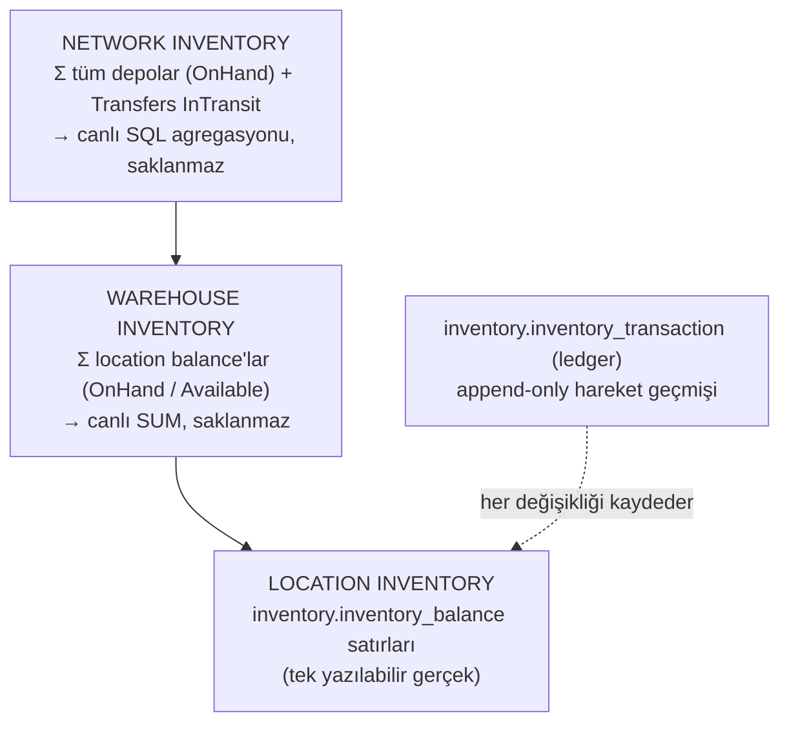

# Inventory Model

> Sistemin kalbi. "Hangi SKU, nerede, ne durumda, kime söz verilmiş?"
> Inventory modülü stok invariant'larının **tek source of truth**'ıdır; herkes stokla buradan konuşur.

## Üç Bakış Açısı



Örnek (SKU `KALEM-001`):

```text
Network  OnHand = 1.000
├── Bursa     OnHand 500   (A01=100, A02=400)
└── İstanbul  OnHand 500   (B01=250, B02=250)
```

## Balance: Durum Bölmeli Model (ADR-0003)

**Karar:** `OnHand` tek bir sayı değildir; her `(Warehouse, Location, SKU)` için
fiziksel stok **durum kovalarına** bölünür. `Allocated` ayrı bir talep sayacıdır (durum değil).

```text
inventory.inventory_balance
  PK (warehouse_id, location_id, sku_id, status)

  status        : AVAILABLE | HOLD | QUARANTINE | DAMAGED   (extensible enum)
  quantity      : int, CHECK (quantity >= 0)
  allocated     : int, CHECK (allocated >= 0),
                  CHECK (allocated <= quantity),
                  CHECK (status = 'AVAILABLE' OR allocated = 0)
  row_version   : concurrency token (optimistic)
```

## Kavram Sözlüğü (kesin semantik — bu belge tek otoritedir)

| Kavram | Tanım | Saklanır mı? |
|---|---|---|
| **AVAILABLE** | Fiziksel olarak depoda olan, hiçbir kısıt taşımayan stok. **Allocation'a açık olan TEK kova.** | Kova olarak evet |
| **HOLD** | Operasyonel/manuel blokaj altındaki stok (sayımda kilitli, bekletmede vb.). Sipariş allocation'ına **GİREMEZ**. | Kova olarak evet |
| **QUARANTINE** | Kalite kontrol sürecinde bekleyen stok. Allocation'a **GİREMEZ**. | Kova olarak evet |
| **DAMAGED** | Hasar görmüş / satılamaz stok. Allocation'a **GİREMEZ**. | Kova olarak evet |
| **OnHand** | Bir location×SKU'daki **fiziksel** toplam: `Σ quantity` (tüm kovalar). | Hesaplanır |
| **AllocatableOnHand** | `AVAILABLE` kovasının `quantity`'si — allocation'a uygun fiziksel stok. | Hesaplanır |
| **Allocated** | "Bu fiziksel stok bir belgeye **söz verildi**" sayacı. Fiziksel konumu/OnHand'i DEĞİŞTİRMEZ; yalnız AVAILABLE kovasında > 0 olabilir. | Sayaç olarak evet |
| **Available (AvailableToPromise / ATP)** | Yeni allocation'lara söz verilebilir miktar: `Σ(quantity − allocated)` over **AVAILABLE** kovaları. | **Asla saklanmaz** — türetilir |

## Available Türetimi (tek formül, tek anlam)

```text
Location  : Available = Σ_AVAILABLE (quantity − allocated)
Warehouse : Available = Σ location'lar üzerinden aynı formül
Network   : Available = Σ warehouse'lar + Transfers InTransit (transfer pozisyonu)
```

- **Available writable source of truth DEĞİLDİR.** Tek authoritative kaynak:
  `inventory_balance` satırlarının `quantity` ve `allocated` alanlarıdır.
- Available'ı üreten başka hiçbir mekanizma yoktur; saklanan `available` kolonu bilinçli olarak **üretilmez**.

### Tam Örnek

```text
A01 × KALEM-001:
  AVAILABLE   quantity=100, allocated=20
  HOLD        quantity=10
  QUARANTINE  quantity=5
  DAMAGED     quantity=2

OnHand            = 117    (fiziksel)
AllocatableOnHand = 100    (yalnız AVAILABLE)
Allocated         = 20     (söz verilmiş)
Available (ATP)   = 80     (yeni söz için kalan)

→ HOLD + QUARANTINE + DAMAGED = 17 birim sipariş allocation'ına ASLA giremez.
```

Allocation sonrası OnHand hâlâ 117'dir (fiziksel değişim olmadı); değişen yalnızca
`allocated` sayacıdır → Available 80. Pick (Consume) gerçekleştiğinde **hem** `quantity`
hem `allocated` düşer: OnHand ve talep birlikte kapanır.

### Status Semantiği ve Geçişler

| Status | Anlam | Tipik geçişler |
|---|---|---|
| AVAILABLE | Satılabilir / kullanılabilir | → HOLD, → QUARANTINE, → DAMAGED |
| HOLD | Operasyonel tutma | → AVAILABLE, → DAMAGED |
| QUARANTINE | Kalite kontrol bekleme | → AVAILABLE (kabul), → DAMAGED (red) |
| DAMAGED | Hasarlı / satılamaz | → (adjust out / imha — explicit komut) |

- Durum değişimi **explicit komutla** olur (`ChangeStatus`); `quantity` keyfi düzenlenemez.
- İki kavram bilinçli olarak kova DEĞİLDİR:
  - **ALLOCATED** → `allocated` sayacı + `inventory.inventory_reservation` kaydı — Inventory'nin
    **tek sahipliği** (ADR-0006). Outbound allocation state'i yazmaz; kontratla talep eder,
    reservation id'yi referanslar.
  - **IN_TRANSIT** → Transfers modülünün sahipliği (bkz. [TRANSFER_MODEL.md](TRANSFER_MODEL.md)).
    Depo balance'ında IN_TRANSIT kovası YOKTUR; aksi halde iki modül tek kavrama yazar.

## Açık Invariant'lar

1. **Allocation yalnız allocation'a uygun stoktan**: koşullu UPDATE `status='AVAILABLE'` —
   HOLD/QUARANTINE/DAMAGED kovalarına allocation yapısal olarak imkânsızdır (DB koşulu + test).
2. **HOLD / QUARANTINE / DAMAGED sipariş allocation'ına girmez** (1'in sonucu; unit test ile kilitlenir).
3. **`Available` writable truth değildir**; tek türetim formülü `Σ_AVAILABLE(quantity − allocated)`.
   Başka formül/anlam yok; `available` kolonu hiçbir tabloda yok.
4. **Allocation ≠ fiziksel hareket**: `Allocate/Deallocate` yalnız sayacı değiştirir;
   OnHand yalnızca fiziksel komutlarla değişir (Receive, Move, Consume, Adjust, TransferOut, TransferIn).
5. `quantity >= 0`, `allocated >= 0`, `allocated <= quantity`, `allocated>0 ⇒ AVAILABLE` — DB CHECK.
6. **Warehouse-total korunumu**: location→location move, warehouse OnHand toplamını değiştirmez.
7. **Transfer-op nötrlüğü** (transfer lifecycle'ına ÖZGÜ invariant — global network invariant DEĞİLDİR):
   Bir transferin kendi muhasebesi içinde — kaynak çıkışı (−shipped), InTransit pozisyonu ve hedef
   girişi (+received) — network toplamına net etki **0**'dır; transfer stoku yaratmaz/yok etmez,
   yalnızca yerini değiştirir. **Receiving, müşteri sevkiyatı, hasar, adjustment, disposal
   network toplamını meşru olarak DEĞİŞTİRİR** — bu işlemler için böyle bir invariant yoktur.
8. **Blokajlı/inaktif location'a stok yazılmaz** (`IsBlocked`, `IsActive=false`,
   `AllowsPutaway=false` → kontrat reddeder; bkz. [CONSISTENCY.md](CONSISTENCY.md)).
9. **Leaf-stock**: çocuğu olan location'a stok konmaz (Facility kuralıyla ortak).

1-5 DB constraint + atomik update ile; 6-9 domain + entegrasyon testleriyle korunur.

## Balance ↔ Ledger Ayrımı

| Soru | Cevap kaynağı |
|---|---|
| "Şu an stok ne durumda?" | `inventory_balance` (current state) |
| "Bu duruma nasıl geldik?" | `inventory_transaction` (ledger, append-only) |

```text
inventory.inventory_transaction (ledger)
  id
  warehouse_id, sku_id
  location_id_from / location_id_to      → move/putaway'de iki uç
  location_code_from / location_code_to  → snapshot (FK'sız dünyada okunabilirlik)
  status_from / status_to                → durum değişimlerinde
  quantity_delta                         → +/- (fiziksel değişim)
  tx_type        : RECEIVE | MOVE | ADJUST | PICK | TRANSFER_OUT | TRANSFER_IN
                   | STATUS_CHANGE | CYCLE_COUNT_ADJUST
  reference_type, reference_id, line_no  → kaynak belge (Receipt, TransferLine, PickTask...)
  occurred_at, actor_id, correlation_id
  UNIQUE (reference_type, reference_id, line_no)   → idempotency anahtarı
```

Kurallar:

- Ledger **append-only**: UPDATE/DELETE yok; düzeltme = yeni ters hareket + yeni satır.
- Ledger ≠ Event Sourcing: current state tabloları korunur; ledger yalnızca hareket kaydıdır.
- Ledger ≠ AuditLog: ledger stok hareketini, AuditLog (Administration) kim/ne değiştirdi kaydını tutar.
- Her balance değişimi aynı transaction içinde en az bir ledger satırı üretir
  (test ile doğrulanır: "balance'ı değiştiren her yol ledger bırakır").

## Reservation (Inventory'nin tek sahipliğinde — ADR-0006)

```text
inventory.inventory_reservation
  id, warehouse_id, sku_id, location_id
  quantity, type (ORDER | TRANSFER)
  reference_type, reference_id        → sipariş satırı / transfer satırı referansı
  state          : ALLOCATED → CONSUMED | RELEASED
  created_at, actor_id
```

- Reservation, "bu stok kime söz verildi" sorusunun **belgesel** cevabıdır; `allocated`
  sayacı onun fast-path toplamıdır. İkisi Inventory'nin aynı transaction'ında değişir.
- **Outbound/Transfers reservation state'i YAZMAZ**: `Allocate` çağırır, reservation id alır,
  kendi workflow belgesinde id'yi referanslar. İptalde `Deallocate(reservationId)` çağırır.
- Lifecycle tek yerde: ALLOCATED → (pick) CONSUMED / (iptal) RELEASED. "Hayalet allocated"
  yapısal olarak önlenir.

## Hareket Tipleri

| Komut (Inventory kontratı) | Etki | Ledger |
|---|---|---|
| `Receive` (giriş) | Hedef location'da AVAILABLE quantity += q | RECEIVE |
| `Move` (location→location) | Kaynak −, hedef + (aynı status) | MOVE (tek satır, from/to) |
| `Adjust` (±) | Quantity düzeltmesi (cycle count sonucu vb.) | ADJUST |
| `ChangeStatus` | Kaynak status −, hedef status + | STATUS_CHANGE |
| `Allocate` | Location seçer, reservation oluşturur (ALLOCATED), `allocated += q` (AVAILABLE) — **reservation id döner** | — (fiziksel değişim yok) |
| `Deallocate` | reservation → RELEASED, `allocated -= q` | — |
| `Consume` (pick sonrası) | reservation → CONSUMED, `quantity -= q` VE `allocated -= q` | PICK |
| `TransferOut` | Kaynak depo quantity − | TRANSFER_OUT |
| `TransferIn` | Hedef depo quantity + | TRANSFER_IN |

## Concurrency (özet)

- Allocation: **atomic koşullu UPDATE** — `WHERE status='AVAILABLE' AND quantity - allocated >= @q`
  — etkilenen satır sayısı kontrolü; 0 satır → `InsufficientInventory` hatası (race-proof).
- Move/Adjust/ChangeStatus: `row_version` ile optimistic concurrency; çakışmada yeniden dene / hata ver.
- Detaylar ve senaryo testleri: [CONSISTENCY.md](CONSISTENCY.md).

## Network Görünümü (ADR-0005)

MVP'de ayrı projeksiyon tablosu YOKTUR. Warehouse ve network toplamları index'li SQL
agregasyonuyla anlık hesaplanır:

```text
Warehouse view : SELECT sku_id, status, SUM(quantity), SUM(allocated)
                 FROM inventory.inventory_balance WHERE warehouse_id = @w GROUP BY sku_id, status
```

### İki AYRI network metriği (karıştırılmaz)

| Metrik | Formül | InTransit | Anlam |
|---|---|---|---|
| **NetworkPhysicalStock** | `Σ warehouse OnHand + Σ in_transit` | **DAHİL** | Stok fiziksel olarak ağın neresinde (depolarda + yolda) |
| **NetworkAvailableToPromise (ATP)** | `Σ warehouse Available` | **DAHİL DEĞİL (MVP)** | Yeni siparişlere söz verilebilir miktar |

- **Yoldaki stok satılabilir stok DEĞİLDİR** — MVP'de NetworkATP'ye girmez.
- InTransit'in ATP'ye dahil edilip edilmeyeceği (ör. transfer ETA/SLA'sına göre promise
  verilmesi) ileride bir **business policy** kararıdır; MVP'de implement edilmez.
- Bu iki metrik UI/raporlarda ayrı gösterilir; aynı kavram gibi kullanılmaz.
- SKU drill-down (Network → Warehouse → Location) her iki metriği de ayrı sunar.

Gerekli index'ler: `(warehouse_id, sku_id)`, `(sku_id, status)` — erken optimizasyon değil,
sorgu tasarımı. Event-beslemeli projeksiyon Phase 11/13'te gerçek ihtiyaçla eklenir
(eventual consistency kuralları [INTEGRATION.md](INTEGRATION.md)'de hazırdır).

## Implementation Status (Phase 7)

Phase 7'de model uygulandı ve gerçek PostgreSQL üzerinde doğrulandı:

- **Balance = current truth**: inventory.inventory_balance — PK (sku_id, warehouse_id, location_id, status)
  UNIQUE; quantity, llocated, xmin (optimistic concurrency token — Phase 8 hareketleri için hazır).
  Available **derived**'dır, hiçbir yerde persist edilmez.
- **DB constraint'ler** (gerçek PG'de testli): quantity >= 0, llocated >= 0, llocated <= quantity,
  status = 'AVAILABLE' OR allocated = 0; reservation/line pozitiflik CHECK'leri.
- **Ledger = history**: inventory.inventory_ledger append-only (OPENING_BALANCE, RESERVED,
  RESERVATION_RELEASED, RESERVATION_CONSUMED); her mutasyon balance ile aynı transaction'da yazılır
  (opening balance tek raw-SQL transaction; reserve/release/consume tek SaveChanges transaction).
- **Reservation = demand claim**: inventory.inventory_reservation + inventory_reservation_line
  (multi-location split destekli); lifecycle ALLOCATED → CONSUMED | RELEASED; terminal state'ler kilitli;
  Allocated yalnızca reservation lifecycle'ı üzerinden değişir.
- **Atomik allocation**: SELECT ... FOR UPDATE (location_id sıralı, deterministic) + xmin koşullu
  UPDATE; yetersiz stokta tüm transaction rollback — partial reservation bırakılmaz. Process-level
  lock/Semaphore YOK; koruma DB seviyesinde (çok process'e hazır).
- **Idempotency**: inventory.inventory_operation (request_id PK) + inventory_reservation.request_id
  UNIQUE; aynı RequestId tekrarında aynı sonuç döner, ikinci state mutation OLUŞMAZ.
- **Cross-module references**: Inventory yalnızca MasterData.Contracts / Facility.Contracts
  public yüzeylerine bağımlıdır (SKU/warehouse/location varlık + aktiflik + HoldsInventory doğrulaması);
  cross-module DB FK YOK (testle kanıtlı). Architecture testi eklendi: çapraz modül erişimi yalnızca
  *.Contracts namespace'lerine izin verir.
- **Contract**: Inventory.Contracts.IInventoryContract (GetAvailability/Reserve/Release/Consume) —
  Outbound/Transfers Phase 10/12'de bunu kullanacak; Inventory.Domain/Infrastructure dışarı kapalı.
- **Concurrency acceptance**: Available=1, iki paralel Reserve → tam olarak biri kazanır;
  final quantity=1, allocated=1, available=0 (gerçek PostgreSQL, paralel context'ler).

## Implementation Status (Phase 8 — Movement)

### Relocation (aynı warehouse içi)

`	ext
RELOCATION — A01 ──Quantity −X──▶ B01 (MovementId korelasyonu)
  A01 AVAILABLE:  quantity -= X   (yalnızca serbest stok: X <= quantity - allocated)
  B01 AVAILABLE:  quantity += X   (yoksa ON CONFLICT ile yaratılır — duplicate balance imkânsız)
  Ledger: RELOCATED_OUT (-X) + RELOCATED_IN (+X) — aynı MovementId
`

### Status Change (aynı location, farklı statü)

`	ext
STATUS CHANGE — AVAILABLE ──X──▶ QUARANTINE
  AVAILABLE:   quantity -= X   (allocated kısım ASLA statü dışına çıkamaz)
  QUARANTINE:  quantity += X
  Ledger: STATUS_CHANGED_FROM (-X) + STATUS_CHANGED_TO (+X) — aynı MovementId
`

### Açık Invariant (uygulandı + testli)

> Internal relocation veya status reclassification warehouse physical stock toplamını DEĞİŞTİRMEZ.

### Güvenlik Mekanizmaları

- **Atomiklik**: tek explicit transaction içinde operation row + source decrement + destination
  increment/upsert + movement + ledger — biri başarısızsa tümü rollback (crash-safe).
- **Concurrency**: kilit sorgusu SELECT ... WHERE id IN (src, dst) ORDER BY id FOR UPDATE
  (deterministic lock ordering — A→B / B→A deadlock üretmez); destination yoksa atomik
  ON CONFLICT DO UPDATE upsert. Kilit altında yeniden kontrol UnallocatedQuantity < qty →
  InsufficientInventoryException. EF identity-resolution tuzağı ChangeTracker.Clear() ile
  engellendi (eski xmin ile UPDATE → DbUpdateConcurrencyException riski).
- **Reservation güvenliği**: taşınabilir miktar = Quantity - Allocated (AVAILABLE);
  allocated stok ne relocate ne status change ile taşınabilir (testli).
- **Idempotency**: inventory_operation.request_id PK + inventory_movement.request_id UNIQUE —
  aynı RequestId tekrarında AlreadyRecorded + aynı MovementId, ikinci mutation YOK.
- **Cross-warehouse yasak**: kaynak/hedef location'lar aynı warehouse'da olmalı
  (LocationValidationException) — inter-warehouse hareket Phase 12 Transfer'e aittir.
- **Movement record**: inventory_movement (request_id unique, type, kaynak/hedef, status_from/to,
  quantity, occurred_at) business operation identity/correlation içindir; ledger immutable
  muhasebedir — iki tablo ayrı amaçlıdır, duplicate DEĞİLDİR. Ledger'da movement_id kolonu
  hareket girişlerini ilişkilendirir (reconciliation için).
- **Concurrency acceptance**: A01 quantity=10 + iki paralel move(7) → tam olarak biri başarılı;
  final source=3, destination=7; source asla negatif olamaz (gerçek PostgreSQL).

## Implementation Status (Phase 8.1 — Accuracy Foundation)

### Accuracy Signal (Inventory içinde Accuracy alt alanı)

`	ext
SYSTEM EXPECTATION (balance: quantity/allocated/available)
       │
Physical operation (pick)
       ↓
PICK NOT FOUND
       ↓
InventoryAccuracySignal (append-only, request_id UNIQUE)
       ↓
NO AUTOMATIC STOCK CHANGE   ←  Observation is not correction.
       ↓
Future: Risk Assessment (8.2) → Cycle Count (8.3) → Reconciliation (8.4) → Smart Putaway (8.5)
`

- **Tablo**: inventory.inventory_accuracy_signal — signal_type, source_type (PICK/MANUAL_OBSERVATION/
  CYCLE_COUNT/SYSTEM), sku/warehouse/location, source_reference_id, occurred_at, recorded_at +
  **historical snapshot** (system_quantity_at_signal, allocated_at_signal, available_at_signal,
  status_at_signal). CHECK'ler >= 0; indexler: request_id UNIQUE, (sku,location), (warehouse,signal_type), occurred_at.
- **Snapshot ≠ authoritative balance**: sinyal anında sistem ne düşünüyordu sorusunun cevabıdır;
  sonradan balance değişse bile geçmiş analiz bozulmaz (testli). Client'ın snapshot göndermesine
  GÜVENİLMEZ — Inventory kendi balance'ından üretir.
- **Idempotency**: request_id PK/UNIQUE — aynı RF/API retry ikinci sinyal üretmez (Phase 8.2'nin
  "2 consecutive NotFound" kuralının yanlış tetiklenmesini engeller).
- **Append-only**: entity'de public setter YOK (reflection testiyle kilitli); PUT/DELETE endpoint'i YOK.
- **Doğrulama**: SKU/warehouse/location varlık + aktiflik + aidiyet (approved contracts üzerinden);
  cross-module FK yok. Sinyal sonrası deactivate olsa bile tarihsel kayıt korunur (testli).
- **Contract**: IInventoryContract.ReportPickNotFoundAsync(...) — Outbound Phase 10 bunu çağıracak;
  doğrudan tablo INSERT'i mümkün değil (Inventory tek yazar).
- **Query foundation**: GetAccuracySignals (filtreli), GetSignalsForSkuLocation,
  GetRecentNotFoundSignals (days/limit) — Phase 8.2 risk hesaplamalarının girdisi.
- **Movement uyumluluğu**: Phase 8 ledger'ı (occurred_at, location, quantity, movement_id)
  LastMovementAt/MovementCount30d gibi türetmeler için yeterli — yeniden tasarım gerekmedi.
- **API**: POST /api/inventory/accuracy/pick-not-found · GET /api/inventory/accuracy/signals
  (filtreler: warehouse/sku/location/signalType/from/to) · GET .../signals/sku-location ·
  GET .../signals/recent-not-found.

## Implementation Status (Phase 8.2 — Risk / Velocity / ABC-Dead)

### Akış

`	ext
Inventory Ledger + Accuracy Signals + Facility Context
       ↓
Velocity Analysis (30/90/180 gün fiziksel hareket sayıları)
       ↓
ABC (warehouse-relative ranking) / Movement State (ACTIVE/SLOW/DEAD)
       ↓
Risk Policy (explainable rules, merkezi config)
       ↓
Risk Score + Reasons → Ranked Suspicious Inventory
`

> **Risk is evidence for verification, not permission to change inventory.**

### Model

- **VelocityClass (A/B/C)** — SKU'nun warehouse içi hareket hacmi; deterministic warehouse-relative
  ranking (top %20 → A, sonraki %30 → B, kalan → C; config: AbcARatio/AbcBRatio).
- **MovementState (ACTIVE/SLOW/DEAD)** — son fiziksel hareketten gün sayısı
  (0-30/31-180/180+; config: SlowAfterDays/DeadAfterDays). Ayrı kavramlar — "C + DEAD" geçerli kombinasyon.
- **Fiziksel hareket tanımı**: ledger'da quantity_delta <> 0 olan kayıtlar; aynı MovementId'li
  satırlar tek olay sayılır (relocation IN+OUT iki "satış" sayılmaz). RESERVED/RELEASED velocity'ye GİRMEZ (testli).
- **NotFound entegrasyonu**: NotFoundCount7d/30d, LastNotFoundAt, **ConsecutiveNotFound** —
  ardışık zincir, aynı SKU+Location'daki son fiziksel stok hareketinden sonra gelen sinyaller olarak
  tanımlı; fiziksel hareket zinciri kırar (açık kural, testli). 2+ ardışık sinyal → REPEATED_NOT_FOUND +45.
- **Facility context**: LocationInfo.AllowsPicking (contract'a eklendi) — picking lokasyonunda
  hareketsizlik daha şüpheli (+10). Hard-coded Facility sorgusu YOK.
- **Risk Score (0-100)**: çakışmayan kurallar (inactivity kademeleri tek seçilir; REPEATED/RECENT
  tek seçilir): LONG_INACTIVITY 90/180/360+ gün (15/30/45, "hiç hareket yok" = 45),
  REPEATED_NOT_FOUND +45 / RECENT_NOT_FOUND +20, PICKING_LOCATION +10, LOW_VELOCITY +5, DEAD_STOCK +10.
  Seviyeler: 0-30 GREEN, 31-60 YELLOW, 61-80 ORANGE, 81+ RED — tümü **RiskPolicyOptions** ile
  appsettings'ten (Inventory:RiskPolicy) yönetilir; threshold değişimi deterministik (testli).
- **Explainability**: her değerlendirme 
easons[] döner (code + points + açıklama) — "neden kırmızı?"
  cevaplanabilir; skor black-box DEĞİL.
- **Calculated vs stored**: risk hiçbir yerde persist edilmez — on-demand türetilir; authoritative
  kaynaklar ledger/signals/facility'dir. Risk motoru InventoryBalance'ı değiştiremez
  (analyzer'da mutation capability yok — testli). RED → düzeltme değil, CycleCount tetikleyici adayı (8.3).
- **Sorgular**: activity/ABC/NotFound istatistikleri index'li PostgreSQL agregasyonlarıyla
  (ledger: sku/warehouse/location/occurred_at; signals: sku/location/signal_type/occurred_at);
  Elasticsearch/Redis/ClickHouse YOK. İleride SAP movement history canonical adapter üzerinden
  aynı engine'e girebilir — engine SAP movement type bilmez.
- **API**: GET /api/inventory/accuracy/risk (filtreler + riskLevel), GET .../risk/{wh}/{sku}/{loc},
  GET .../high-risk (RED, score desc), GET .../abc-dead-summary (A/B/C + ACTIVE/SLOW/DEAD sayıları).

## Implementation Status (Phase 8.3 — Dynamic Cycle Counting)

### Akış

`	ext
Risk Engine
    ↓
High Risk (RED | 2+ consecutive PICK_NOT_FOUND)
    ↓
Cycle Count Task (reason + priority + risk score + evidence — neden üretildiği KAYBOLMAZ)
    ↓
Blind Count (counter'a expected quantity GÖSTERİLMEZ)
    ↓
Physical Quantity
    ↓
Compare with Expected Snapshot (start anında server-side)
    ↓
Variance
    │
    ├── 0 → Verified
    │
    └── != 0 → VarianceDetected → Reconciliation Required (Phase 8.4)
`

> **Counting observes reality; it does not silently rewrite inventory.**

### Model

- cycle_count_task: warehouse/location/sku, reason (REPEATED_NOT_FOUND | HIGH_RISK), priority
  (LOW/MEDIUM/HIGH/CRITICAL), risk_score_at_creation, evidence (neden metni), status
  (PENDING/IN_PROGRESS/COMPLETED/CANCELLED), assigned_to, started/completed, expected snapshot
  (start anında doldurulur: quantity/allocated/status — server-side, counter'a gösterilmez).
- cycle_count_result: counted_quantity, counted_by, counted_at, expected snapshot kopyası,
  **variance (derived: counted − expected)**, outcome (VERIFIED | VARIANCEDETECTED | STALERECOUNTREQUIRED),
  RequiresReconciliation türetilmiş. Append-only: public setter YOK; geçmiş overwrite edilemez
  (yanlış sayım → yeni recount).
- **Trigger kuralları (deterministic)**: consecutive PICK_NOT_FOUND ≥ 2 (Rule A) veya RED (Rule B).
  Priority: RED+repeated → CRITICAL, RED → HIGH, sadece repeated → MEDIUM. GREEN/ORANGE task üretmez.
- **Duplicate engeli (concurrency-safe)**: partial unique index
  (sku, warehouse, location) WHERE status IN ('PENDING','INPROGRESS') — aynı anda tek aktif task;
  paralel evaluate'ta kaybeden 23505 → skip. 3 paralel evaluate testi: tam 1 task (gerçek PostgreSQL).
- **Stale policy (§12)**: start sonrası aynı location'da fiziksel hareket olduysa (ledger LastAt >
  StartedAt) sonuç STALERECOUNTREQUIRED — sessizce variance/adjustment'a GÖNDERİLMEZ; yeni count
  evaluate ile yeniden üretilebilir (testli).
- **Risk geri beslemesi (§20)**: VERIFIED sonuç NotFound streak'ini kırar — 8.2 consecutive hesabı
  boundary'yi max(son fiziksel hareket, son verified count) olarak alır (testli: 2 sinyal → verify → consecutive=0).
- **Blind count**: task response DTO'sunda expected alanları YOK (reflection testli); counter yalnız
  countedQuantity gönderir; server variance'ı hesaplar.
- **Stok DEĞİŞMEZ**: complete sonucu balance'a dokunmaz (testli); variance Phase 8.4 Reconciliation'a
  açık çıktıdır (RequiresReconciliation=true).
- **API**: POST /api/inventory/accuracy/cycle-counts/evaluate · GET .../cycle-counts (filtreli) ·
  GET .../cycle-counts/{id} · GET .../cycle-counts/queue (priority desc, created asc) ·
  POST .../{id}/start · POST .../{id}/complete · POST .../{id}/cancel.
- **DB**: inventory şemasında cycle_count_task + cycle_count_result; migration
  AddCycleCounting uygulandı; indexler warehouse/status/priority, created_at, result-per-task UNIQUE.

## Implementation Status (Phase 8.4 — Reconciliation & Controlled Adjustment)

### Akış

`	ext
Blind Cycle Count → Expected 8, Counted 3 → Variance -5
       ↓
Reconciliation (OPEN; variance != 0 ise otomatik oluşur — result başına TEK, DB unique)
       ↓
Current State Validation (approve anında balance tekrar kilitlenir ve doğrulanır)
       ↓
Approve (delta üzerinden; client newQuantity GÖNDEREMEZ)
       ↓
Inventory Adjustment -5 → Balance + Ledger (INVENTORY_ADJUSTMENT) + Adjustment kaydı +
DiscrepancyConfirmed signal'ı + case APPROVED — TEK transaction
`

> **Stock is never silently overwritten.**
> **Every correction must be explainable from physical evidence to ledger entry.**

### Model

- inventory_reconciliation: count task/result bağlantısı, expected/counted/variance, reason
  (CYCLE_COUNT_VARIANCE | LOST | FOUND | DAMAGED | MISPLACED | DATA_CORRECTION | OTHER),
  is_large_variance, status (OPEN/APPROVED/REJECTED/CANCELLED), resolved_at/by/note.
  UNIQUE(cycle_count_result_id) — aynı count iki case üretemez. Append-only (setter yok).
- inventory_adjustment: reconciliation bağlantısı, quantity_delta, reason, resolved_by/note/at,
  request_id. UNIQUE(reconciliation_id) + UNIQUE(request_id) — aynı reconciliation'ın iki kez
  uygulanması DB seviyesinde imkânsız.
- **Variance = 0 → case YOK**; VarianceDetected → case CompleteCycleCount ile AYNI transaction'da oluşur.
- **Delta, absolute set değil**: approve 
econciliation.Variance deltasını uygular; client
  newQuantity gönderemez (API contract'ta yok).
- **Stale koruması**: approve, balance satırını FOR UPDATE ile kilitler ve current quantity ==
  expected snapshot kontrolü yapar — sayımdan sonra hareket olmuşsa Stale döner, stok değişmez.
  Ayrıca approve sırasında concurrent hareket xmin/row-lock ile güvenli.
- **Allocated çakışması**: yeni miktar allocated'ın altına düşecekse AdjustmentConflictException
  (409) — allocation ASLA sessizce azaltılmaz; case OPEN kalır (testli: 10/8 → 5 düzeltmesi red).
- **Negatif stok imkânsız**: ApplyAdjustment domain guard'ı + DB CHECK'ler (testli).
- **Status partition**: adjustment yalnızca sayılan partition'ı (AVAILABLE) etkiler; HOLD vb.
  dokunulmaz (testli).
- **Ledger & audit**: INVENTORY_ADJUSTMENT satırı (delta + approval request_id), adjustment kaydı
  (reason + resolved_by + note), reconciliation case (approved + resolution note) — "kim/neden/
  hangi sayımdan" tam izlenebilir.
- **Idempotency**: approve RequestId → operation row PK + UNIQUE(reconciliation_id)/UNIQUE(request_id);
  retry → AlreadyApproved, adjustment bir kez (testli).
- **Reject**: stok değişmez, ledger yok, case REJECTED (idempotent; testli). Cancel benzer.
- **Large variance policy**: |variance| >= LargeVarianceThreshold (config, default 50) →
  is_large_variance=true; approve force=true olmadan reddedilir (testli).
- **Risk geri beslemesi**: APPROVED sonrası aynı tx'de DiscrepancyConfirmed accuracy signal'ı
  yazılır (post-adjustment snapshot ile) — 8.5+ risk kurallarının source evidence'ı. Broker YOK.
- **Manual stock editor YOK**: PUT /inventory/{id} {quantity:127} bilinçli olarak yazılmadı —
  tüm stok değişiklikleri explicit business operation'lardan geçer.
- **API**: GET /api/inventory/accuracy/reconciliations · GET .../{id} · POST .../{id}/approve ·
  POST .../{id}/reject · POST .../{id}/cancel.
- **DB**: inventory_reconciliation + inventory_adjustment (migration AddReconciliation);
  indexler status/warehouse/location+sku/created_at; CHECK'ler (variance<>0, delta<>0, >=0).

## Implementation Status (Phase 8.5 — Scan-Enforced Movement / Smart Putaway Foundation)

### Akış

```text
RF cihazı 3 scan gönderir: (source location code, SKU barcode, destination location code) + qty
       ↓
Server tarafı çözümleme (ID'ler asla client'tan gelmez):
  location code → IFacilityQueryContract.GetLocationByCodeAsync (warehouse-scoped)
                  + GetLocationByCodeGlobalAsync (WrongWarehouse ayrımı için)
  barcode       → IMasterDataQueryContract.GetSkuByBarcodeAsync
       ↓
Sıralı doğrulama → açık rejection kodu + yorumlanabilir reason
       ↓
RelocateStock engine (8.0'ın birebir aynı motoru — çift motor YOK)
       ↓
Movement + ledger + ScanMovementEvidence → TEK transaction
```

> **Scan olmadan stock hareket etmez (strict mode).**
> **Her hareketin scan kanıtı append-only olarak saklanır.**

### Rejection Kodları (RF yorumlayabilir)

| Kod | Anlam |
|---|---|
| `SCAN_REQUIRED` | Üç scan'den biri boş (strict mode — yumuşak geçiş yok) |
| `SOURCE_NOT_FOUND` | Source code bu warehouse'da çözülemedi (global'de de yok) |
| `SKU_NOT_FOUND` | Barcode bir SKU'ya çözülemedi veya SKU pasif |
| `DESTINATION_NOT_FOUND` | Destination code bu warehouse'da çözülemedi (global'de de yok) |
| `LOCATION_INACTIVE` | Lokasyon pasif |
| `WRONG_WAREHOUSE` | Scan başka warehouse'ın lokasyonuna çözüldü (cross-warehouse = Transfer domain'i) |
| `SKU_NOT_AT_SOURCE` | Source lokasyonda o SKU'nun AVAILABLE bakiyesi yok |
| `INSUFFICIENT_AVAILABLE_STOCK` | Serbest stok yetersiz (allocated asla taşınmaz) |
| `DESTINATION_NOT_ALLOWED` | Destination HoldsInventory=false VEYA Dock/Shipping/Staging/Packing/Receiving/CrossDock tipi |

### Model

- `ScanMovementEvidence` (Domain.Accuracy.Scanning, append-only): movement_id, request_id,
  warehouse/sku/source/destination id'leri, ÜÇ ham scan değeri, quantity, device_id, operator_id,
  occurred_at. UNIQUE(movement_id) — her hareketin kanıtı tektir. Hareketle AYNI transaction'da
  yazılır; hareket yoksa kanıt da yok (atomicity testli).
- `ExecuteScannedRelocation` (Application.Accuracy.Scanning): scan çözümleme + sıralı validasyon +
  `RelocateStock.Handle(command, seed)` — hareketin üretimi/kilidi/idempotency'si RelocateStock'ta kalır.
  Sonuç: `ScannedRelocationResult { Status: Completed | Rejected | DuplicateRequest, RejectionCode, ... }`.
- **Destination politikası**: tip bazlı blok listesi (Dock/Shipping/Staging/Packing/Receiving/CrossDock)
  + HoldsInventory=false. SHIPPING alanına putaway scan'i `DESTINATION_NOT_ALLOWED` ile döner —
  karar yeteneklerle (capability) verilir, tip yalnızca açıklamadır.
- **Idempotency**: aynı RequestId → tek movement, tek evidence (sequential + concurrent testli).
  Concurrency'de inventory_operation PK yarışı 8.0'daki aynı mekanizmayla çözülür.
- **Contract genişletmeleri**: `IFacilityQueryContract.GetLocationByCodeAsync/GetLocationByCodeGlobalAsync`
  + `IMasterDataQueryContract.GetSkuByBarcodeAsync` — kontrat üzerinden okuma; inventory yalnızca ID taşır.
- **API**: `POST /api/inventory/movements/scanned-relocation` — girdi scan string'leri (locationId değil!);
  ret → 400 + `{status:"Rejected", rejectionCode, rejectionReason}`; başarı → `{status:"Completed", movementId, evidenceId}`.
- **DB**: inventory.scan_movement_evidence (migration AddScanMovementEvidence);
  UNIQUE(movement_id), indexler request_id / warehouse+sku / occurred_at, CHECK(quantity>0).
- **Bilinçli sınır**: putaway SUGGESTION (optimal yer önerisi) bu fazın kapsamı dışında —
  8.5 yalnızca scan-enforced execution temelini kurar; risk/velocity verisi (8.2) gelecekte
  öneri motoruna beslenecek.
