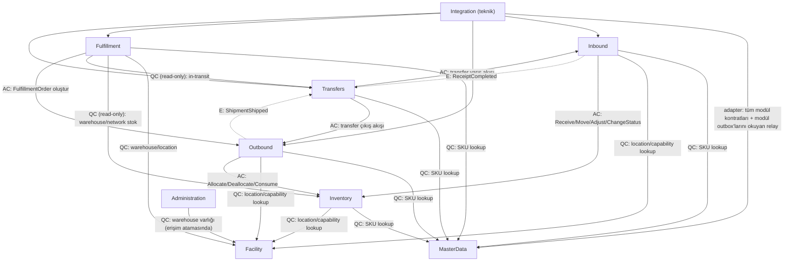
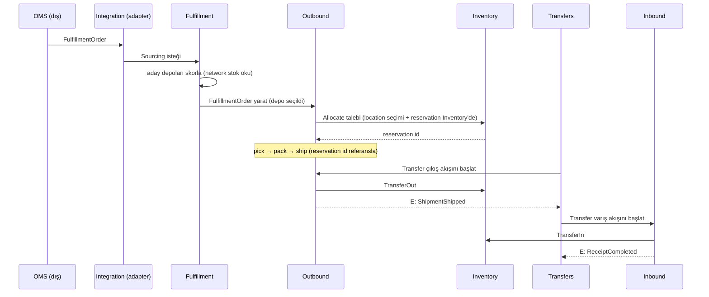

# Module Map

> Bounded Context haritası. Her modül kendi Domain/Application/Infrastructure katmanına sahiptir
> ve diğer modüllerle **yalnızca uygulama kontratları** üzerinden konuşur.
> Bugün bu kontratlar in-process çağrıdır; ileride mesajlaşmaya dönüştürülebilir (bkz. [INTEGRATION.md](INTEGRATION.md)).

## Modül Sınıfları (önemli ayrım)

Tüm modüller aynı türden değildir — üç sınıf vardır:

| Sınıf | Modüller | Açıklama |
|---|---|---|
| **Business Bounded Context** | MasterData, Facility, Inventory, Inbound, Outbound, Transfers, Fulfillment | Gerçek domain mantığı; kendi ubiquitous language + lifecycle |
| **Domain-Support Module** | Administration | Kimlik/erişim domaini — business kuralı vardır (warehouse scope yetki) ama lojistik domain değildir |
| **Technical / Infrastructure Boundary** | Integration | **Business bounded context DEĞİLDİR**; transport ve adaptör altyapısı — aşağıda detaylı |

> **Integration bir business domain değildir.** MasterData/Inventory/Transfers ile aynı anlamda
> "bounded context" olarak gösterilmez. Sorumlulukları: outbox **relay'i**, inbox mekanizması,
> dış sistem adaptörleri (OMS, supplier, carrier), mesaj transportu (ileride RabbitMQ).
> **Event kontratlarının sahibi business modüllerdir** (ör. `inventory.StockChanged.v1` Inventory'nindir);
> Integration yalnızca taşır. Ayrıca outbox **tablosu** Integration'ın değil, her modülün kendi
> şemasındadır (modül-owned outbox) — aksi halde her modül Integration'a yazmak zorunda kalırdı.

## Modüller

| Modül | Sorumluluk | Anahtar Kavramlar | Scope |
|---|---|---|---|
| **MasterData** | Şirket geneli ortak ürün verisi | Product, SKU, Barcode, UOM, Category, Brand, boyut/ağırlık, saklama gereksinimleri | Company |
| **Facility** | Fiziksel dünya: "nereler var?" | Warehouse, Zone, Location (hiyerarşik), LocationCapability, Dock | Company (warehouse) / Warehouse (location) |
| **Inventory** | "Hangi SKU, nerede, ne durumda?" — stok invariant'larının tek sahibi | InventoryBalance, InventoryTransaction (ledger), stok durumu, Allocated sayacı | Warehouse |
| **Inbound** | Depoya giriş operasyonları | InboundShipment, Receipt, Receiving, QC, PutawayTask | Warehouse |
| **Outbound** | Depodan çıkış operasyonları | FulfillmentOrder (yürütme), Allocation, PickTask, Pack, Staging, Shipment | Warehouse |
| **Transfers** | A → InTransit → B network transfer süreci | TransferOrder, TransferLine, InTransit pozisyonu, transfer zaman çizelgesi | Network |
| **Fulfillment** | Sipariş hangi depo(lar)dan karşılanır? | Warehouse sourcing, FulfillmentDecision, network stok okuma (read-only) | Network |
| **Administration** | Kimlik + warehouse-scope yetki + audit log | User, Role, UserWarehouseAccess, AuditLog (ADR-0007) | Company |
| **Integration** *(teknik)* | Dış adaptörler + outbox relay/inbox transport | OMS/supplier/carrier adapter, relay, (ileride) broker | — |
| **Optimization** *(ileride)* | Strateji tabanlı optimizasyonlar — çekirdek domain'e gömülmez | Sourcing stratejileri, putaway stratejisi, slotting, picking route, wave planning | — |

> **Optimization ilk fazlarda ayrı modül DEĞİLDİR.** İlk sürüm deterministic, kural tabanlı
> stratejiler kendi domain'lerinde (ör. Fulfillment içinde `IWarehouseSourcingStrategy`) yaşar;
> gerçek bir variation point oluştuğunda modülleştirilir. Bkz. ADR-0001.

## Bağımlılık Grafiği (edge tipleriyle)

**Edge tipleri:**

- **AC — Application Contract**: senkron komut (owner modülün tanımladığı, consumer'ın çağırdığı use-case).
- **QC — Query Contract**: senkron salt-okuma (varlık/state/metadata sorgusu).
- **E — Domain/Application Event**: kesikli ok **event akış yönünü** gösterir (producer → consumer).
  Derleme bağımlılığı ters yöndedir: consumer, producer'ın event kontratına bağımlı olur
  (Transfers, Outbound/Inbound'ın event kontratlarına bağımlıdır — AC kenarlarıyla aynı yön, cycle yok).

### Cycle Kontrolü (tek tek doğrulandı)

| İlişki | Yön | Cycle? |
|---|---|---|
| Inventory → Facility | QC (location doğrulama) | Yok — Facility Inventory'yi bilmez |
| Inbound → Inventory | AC (stok yazma tek yolu #1) | Yok |
| Outbound → Inventory | AC (stok yazma tek yolu #2) | Yok |
| Transfers → Outbound / Inbound | AC (komut) + E (event tüketimi: Outbound/Inbound **producer**, Transfers **consumer**) | Yok — Outbound/Inbound Transfers'ı bilmez; Transfers event kontratına bağımlı olur (yön değişmez) |
| Fulfillment → Inventory / Transfers | QC read-only | Yok — Inventory/Transfers Fulfillment'ı bilmez |
| Fulfillment → Outbound | AC (order oluştur) | Yok — Outbound Fulfillment'ı bilmez |
| Administration → Facility | QC (erişim atamasında warehouse varlığı) | Yok |
| Integration → herkes | adaptörler + relay | Yok — business modüller Integration'ı **bilmez** (outbox'ları kendi şemalarındadır) |

**Not (Administration ↔ diğer modüller):** Authorization enforcement bir **modül→modül bağımlılığı
DEĞİLDİR**; API/presentation katmanında cross-cutting olarak uygulanır (Administration'ın
`IAccessControl` kontratını yalnızca API katmanı tüketir). Domain modülleri Administration'a
bağımlı OLMAZ. Detay: [ACCESS_CONTROL.md](ACCESS_CONTROL.md), ADR-0007.

### Kurallar

1. **Cyclic dependency YOK.** Yukarıdaki grafik DAG'dır; architecture testleriyle CI'da enforce edilir.
2. **MasterData ve Facility köktür** — hiçbir modüle bağımlı değildir.
3. **Inventory'ye yazma yolu tekilleştirilmiştir**: Inbound ve Outbound dışında hiçbir modül
   stok mutate etmez. Transfers, stok hareketini Outbound (çıkış) ve Inbound (giriş) kontratları
   üzerinden yaptırır. Fulfillment stoka **asla yazmaz** — sourcing bir karardır, rezervasyon değildir.
   **Allocation state de buna dahildir:** Outbound allocation yazmaz; `IInventoryContract.Allocate`
   ile talep eder, Inventory location seçer, reservation oluşturur ve reservation id döner.
   Outbound id'yi yalnızca referanslar (ADR-0006).
4. **Çapraz modül erişim = kontrat, tablo değil.** Bir modül diğerinin tablosuna doğrudan SQL/EF
   erişimi yapamaz; uygulama kontratını çağırır. Kontratlar owner modülde tanımlanır.
5. **ID referansları:** Modüller birbirini `Guid` ID ile referanslar; çapraz navigation property
   zincirleri kurulmaz; çapraz modül foreign key **konulmaz** (ADR-0001; bütünlük stratejisi
   [MULTI_WAREHOUSE_ISOLATION.md](MULTI_WAREHOUSE_ISOLATION.md)).
6. **Event aboneliği kontrat sahibine bağımlılıktır**: Transfers, Outbound'ın event'ini dinliyorsa
   Outbound'ın event kontratına bağımlı olur (yön değişmez, cycle oluşmaz).

### Kontrat Yüzeyleri (özet)

| Modül | Sunduğu kontrat | Tüketiciler |
|---|---|---|
| MasterData | `IProductCatalog` — SKU doğrulama/metadata okuma (QC) | Inventory, Inbound, Outbound, Transfers, Fulfillment |
| Facility | `IFacilityLookup` — warehouse/location varlık + capability sorgusu (QC) | Inventory, Inbound, Outbound, Fulfillment, Administration |
| Inventory | `IInventoryContract` — `Receive`, `Move`, `Adjust`, `Allocate`, `Deallocate`, `Consume`, `TransferOut`, `TransferIn`, `ChangeStatus` (AC) + balance sorguları (QC). `Allocate/Deallocate/Consume` reservation id üzerinden çalışır; allocation state'inin tek yazarı Inventory'dir | Inbound, Outbound |
| Inbound | `IInboundContract` — transfer varışının receiving akışını tetikler (AC) | Transfers |
| Outbound | `IOutboundContract` — transfer çıkışının pick/pack/ship akışını tetikler (AC) | Transfers |
| Fulfillment | `ISourcingService` — sourcing kararı üretir (AC; stok yazmaz) | Integration (OMS akışı) |
| Administration | `IAccessControl` — depo erişim kontrolü (QC) | **yalnızca API katmanı** (enforcement cross-cutting) |
| Integration | dış adapter endpoint'leri (REST) + relay worker | dış sistemler |

### Modüller Arası Olay Akışı (in-process, MVP)

## Anti-Pattern Kırmızı Çizgileri

- ❌ `God WarehouseService` / `God InventoryService` — her şeyi bilen dev servisler.
- ❌ Çapraz modül tablo mutasyonu (ör. Fulfillment'ın `UPDATE inventory.balance` atması).
- ❌ Çapraz warehouse DB erişimi (A deposunun B deposu verisine direkt okuma/yazma).
- ❌ `Product` entity'sine `Quantity` koymak (stok MasterData'da yaşamaz).
- ❌ `Location` entity'sine `ProductId + Quantity` gömmek (stok Facility'de yaşamaz).
- ❌ Transfer'i `Inventory.Move(A, B)` olarak modellemek — ayrı business process'tir.
- ❌ Her interaction için RabbitMQ kullanmak (bkz. [INTEGRATION.md](INTEGRATION.md)).
- ❌ Integration'ı domain mantığıyla doldurmak — Integration transport/adaptördür, karar vermez.

Detaylı ownership: [DATA_OWNERSHIP.md](DATA_OWNERSHIP.md).
