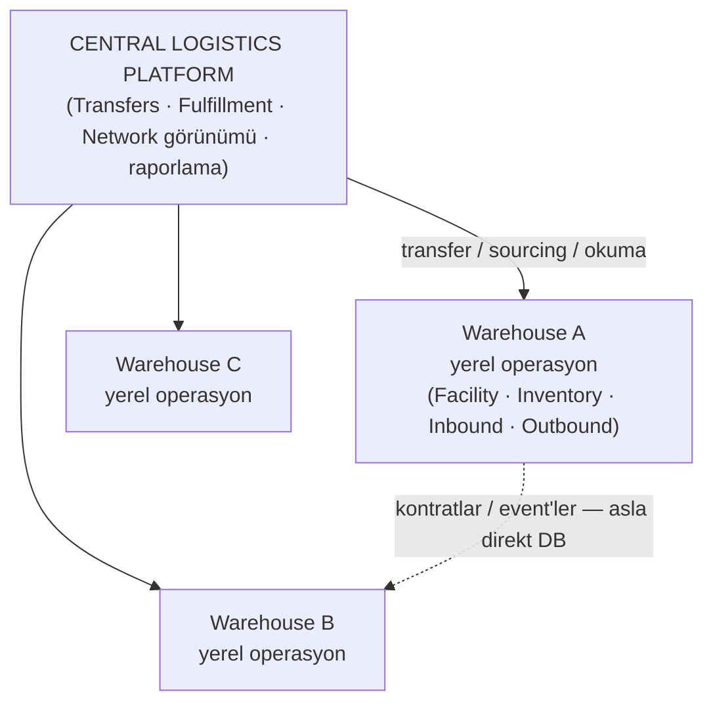

# Multi-Warehouse Isolation Strategy

> "Depolar birbirine bağlı olmalı ama birbirine bağımlı olmamalı."
> Bu belge, bu ilkenin **bugün tek process + tek PostgreSQL** içinde nasıl garanti edildiğini
> ve ileride fiziksel ayrışmaya nasıl taşınacağını tanımlar.

## Üç Kapsam (Scope)

| Scope | Tanım | Örnekler | Nerede yaşar |
|---|---|---|---|
| **Company** | Tüm şirket geneli, depo bilmez | SKU, Product, UOM, User, Warehouse (kayıt olarak) | MasterData, Administration, Facility |
| **Warehouse** | Bir fiziksel deponun operasyonel gerçeği | Location, InventoryBalance, Receipt, PickTask, Shipment | Facility, Inventory, Inbound, Outbound |
| **Network** | Depolar üstü koordinasyon görünümü | TransferOrder, InTransit, FulfillmentDecision, Network Inventory | Transfers, Fulfillment |

Her warehouse-scope tablo `WarehouseId` taşır. Network-scope tablolar tekil depoya ait değildir
(TransferOrder kaynak+hedef ID çifti taşır).

## İzolasyon Katmanları (bugünün garantileri)

### 1. Modül sınırı (kod)
- Her modül ayrı proje; bağımlılıklar tek yönlü DAG (bkz. [MODULE_MAP.md](MODULE_MAP.md)).
- Çapraz modül erişim yalnız kontrat üzerinden — tablo erişimi yok.
- Architecture testleri bu kuralları CI'da zorunlu tutar.

### 2. Veritabanı şeması (DB)
- Her modül kendi PostgreSQL şeması: `master_data`, `facility`, `inventory`, `inbound`,
  `outbound`, `transfers`, `fulfillment`, `administration`, `integration`.
- Çapraz modül **foreign key YOK**; referanslar `Guid` kolonu olarak saklanır.
  Bütünlük stratejisi aşağıda ("FK'sız Referans Bütünlüğü") açıktır (ADR-0001).

### 3. Stok yazma yolu (domain)
- Stok mutasyonu yalnızca `Inventory` modülünün kontratı üzerinden yapılabilir.
- İki depo arası hareket ancak bir `TransferOrder` (Transfers modülü) ile mümkündür —
  "A'dan B'ye taşı" diye bir Inventory komutu yoktur. Cross-warehouse `Move` **API'de yasak**.

### 4. Yetkilendirme (erişim)
- Her kullanıcının depo erişim seti vardır (UserWarehouseAccess, ADR-0007).
- Warehouse-scope mutation'lar yalnızca erişim setindeki depolar için geçer.
- Backend enforce eder; frontend yalnızca gizler (bkz. [ACCESS_CONTROL.md](ACCESS_CONTROL.md)).

### 5. Sorgu disiplini
- Warehouse-scope tüm sorgular `WarehouseId` filtresiyle başlar (anti-pattern: "WarehouseId
  filtresini unutmak"). Bu filtre çoğunlukla authorize edilmiş kullanıcı scope'undan türetilir,
  request body'den değil.

## FK'sız Referans Bütünlüğü (cross-module integrity stratejisi)

Inventory `location_id` tutar ama DB'de Facility'ye FK yoktur. Bu bilinçli bir karardır;
sonuçları ve telafi mekanizmaları şunlardır:

### Location'ın geçerliliği nasıl doğrulanır?
- **Yazma zamanında, kontrat içinde**: Inventory'nin her yazma komutu (Receive, Move, ...)
  girişinde `IFacilityLookup` ile location'ın **var olduğu**, **aktif olduğu** ve
  **capability'sinin komuta uygun olduğu** doğrulanır. Geçersiz → `LocationNotFound` /
  `LocationBlocked` / `LocationNotSuitable` domain hataları (asla 500 değil).
- Bu "uygulama seviyesi FK"dır; her yazma yolu integration testiyle kilitlenir.

### Stok bulunan location silinebilir mi?
- **Hayır — hard delete YOKTUR.** Location lifecycle: `IsActive=false` (deactivate) ve
  ileride `retire` işaretidir. Satır fiziksel olarak silinmediği için ledger/balance'daki
  tarihsel referanslar **her zaman çözülebilir** kalır.
- Deaktif location'a yeni stok yazılamaz (yazma zamanı kontrolü).
- Deaktif location üzerinde kalan stok: operasyonel olarak taşınması beklenir; bu durum
  uzlaşma/anomali ekranında görünür kalır (bkz. [CONSISTENCY.md](CONSISTENCY.md)).

### Warehouse / Location lifecycle nasıl yönetilir?
- **Warehouse**: `IsActive=false` → yeni receipt/transfer hedefi olamaz; kapanış "retire"dır.
- **Location**: deactivate (stok olabilir, giriş yasak) → stok boşaltıldıktan sonra retire.
  "Stok boş mu?" kontrolü modül DAG'ını bozmamak için **API seviyesinde bir koordinasyon
  use-case'i** (Facility + Inventory kontratlarını çağıran application service) ile yapılır —
  Facility → Inventory bağımlılığı KURULMAZ.
- **Historical references nasıl korunur?**
  - Ledger satırlarına `location_id` yanında `location_code` **snapshot**'ı yazılır
    (FK'sız dünyada okunabilirlik).
  - Location satırları hiç silinmez; değişiklikler immutable geçmiş (name/code değişimi
    tarihsel kayıtta görünür olmalı — gerekiyorsa history tablosu, Phase 6'da).

### Orphan / anomali tespiti
- Periyodik uzlaşma sorgusu: mevcut olmayan location'a referans veren balance satırı,
  deaktif location'da kalan stok, kırık SKU referansları → admin ekranında listelenir.
- Amaç: FK'sız dünyada bütünlük ihlali **sessiz kalamaz**.

## Kavramsal Hedef Topoloji

## Evrim Yolu: Logical → Physical Independence

| Aşama | Process | DB | İzolasyon mekanizması | Ne zaman? |
|---|---|---|---|---|
| **1. Monolith (MVP)** | tek | tek PG, modül şemaları | modül kontratları + şema sınırları + WarehouseId + auth | başlangıç |
| **2. Monolith + Broker** | tek | tek PG | + RabbitMQ, outbox/inbox, event kontratları | dış entegrasyon / asenkron ihtiyaç |
| **3. Central + Warehouse Runtime'lar** | çok | depo başına DB | kontratlar → mesajlar; outbox/inbox; idempotency | gerçek ölçek/coğrafi ihtiyaç |

**Aşama 1'deki hazırlıklar** (bugünden yapılan, sonradan pahalı olacak işler):

- Modül şemalarının ayrı olması → DB bölünmesi yalnızca "hangi şema hangi DB'ye" kararına döner.
- Çapraz FK olmaması → DB bölünmesi kısıt ihlali üretmez.
- Kontrat tabanlı çağrılar → in-process çağrıyı mesaja çevirmek adaptör değişikliğidir.
- Tüm mutasyonların event üretmesi (domain event) → outbox entegrasyonu hazır.
- Idempotency anahtarları (ReceiptId, OrderExternalId...) → tekrar teslim senaryolarında kayıpsız.

**Aşama 1'de iddia ETMEDİĞİMİZ şey:** "Depolar fiziksel olarak bağımsız çalışıyor."
Aşama 3'e geçilirse depo runtime'ları belirli local operasyonları (receive, pick, move) merkezi
sistem çökmüşken sürdürebilecek şekilde tasarlanabilir — bu hedef şimdilik dokümante edilir, uygulanmaz.

## Kabul Testleri (izolasyonun doğrulanması)

1. **Multi-warehouse senaryo** (ROADMAP Phase 8/12): A içi move A toplamını değiştirmez;
   A→B transferinde transfer-op nötrlüğü her adımda korunur (transfer-iz toplamı sabit;
   B receive edilene kadar A'daki düşüş InTransit'te görünür).
2. **Yetki senaryosu**: Bursa WarehouseManager İstanbul envanterinde mutation yapamaz;
   NetworkViewer tüm depoları görür ama yazamaz.
3. **Concurrency senaryosu**: `Available=1`, iki eşzamanlı allocation'dan yalnız biri başarılı.
