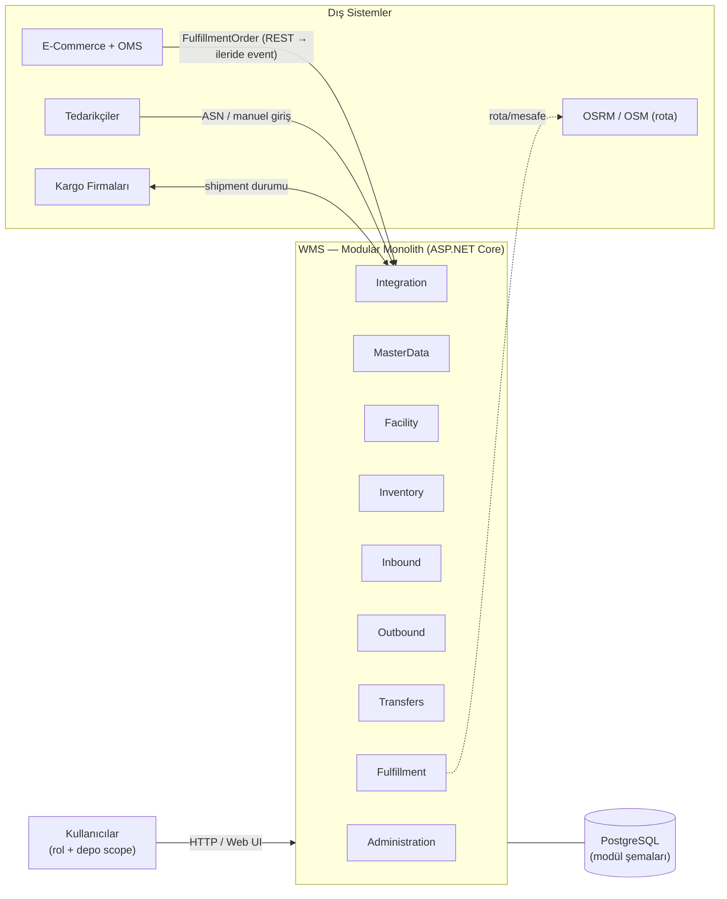
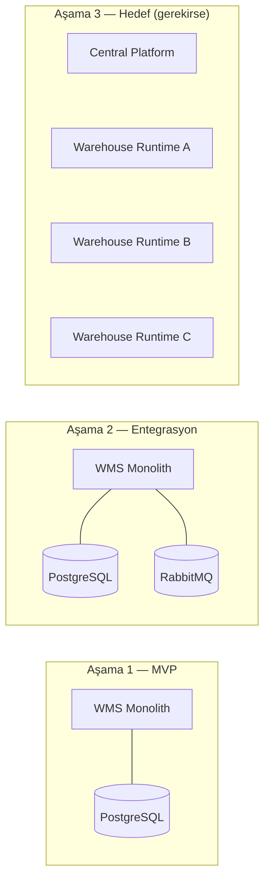

# System Context

> Bu belge sistemin kiminle, neyin sınırında konuştuğunu tanımlar. Ayrıntılar diğer belgelere dağıtılmıştır; burası kuşbakışı giriş noktasıdır.

## Amaç

Multi-warehouse e-ticaret / perakende **Warehouse Management System (WMS)**.
Şirketin birden fazla fiziksel deposu vardır (Bursa, İstanbul, İnegöl, gelecekte yenileri) ve
her deponun fiziksel topolojisi birbirinden farklı olabilir.

Sistem şunları **yapmaz**:

- Ödeme, kupon, kampanya, checkout → bunlar E-Commerce/OMS tarafındadır.
- Müşteri siparişi yönetimi → WMS'e yalnızca `FulfillmentOrder` gelir.
- ERP finans fonksiyonları → ileride opsiyonel dış entegrasyon.

## Aktörler ve Dış Sistemler

| Aktör / Sistem | Tür | WMS ile ilişkisi |
|---|---|---|
| SystemAdmin | İç kullanıcı | Tüm config, kullanıcı, depo yönetimi |
| NetworkManager | İç kullanıcı | Network seviyesi görünüm: transferler, sourcing, tüm depolar |
| WarehouseManager | İç kullanıcı | **Tek veya birkaç depoya** kapsamlı yetki (scope: warehouse) |
| Operator | İç kullanıcı | Giriş/çıkış operasyonları (scope: warehouse) |
| Picker | İç kullanıcı | Picking task'leri (scope: warehouse) |
| Viewer | İç kullanıcı | Salt okunur (scope: warehouse veya network) |
| E-Commerce + OMS | Dış sistem | `FulfillmentOrder` gönderir; karşılama sonucunu geri alır |
| Tedarikçiler (Supplier) | Dış sistem | ASN (Advanced Shipment Notice) veya manuel giriş ile gelen sevkiyat |
| Kargo / Carrier | Dış sistem | Sevkiyat durumu güncellemesi, etiket/takip no |
| OSRM / OSM | Dış servis | Sourcing için rota/mesafe (ücretsiz; provider abstraction arkasında) |

Yetki detayları: [ACCESS_CONTROL.md](ACCESS_CONTROL.md).

## Sistem Sınırı

- **Aktörler WMS'e girer** → yetki + warehouse scope zorunlu (backend enforced).
- **OMS/WMS sınırı**: `FulfillmentOrder` içeri, fulfillment sonucu dışarı. Sipariş state makinesi OMS'te kalır.
- **Supplier sınırı**: ASN veya manuel giriş → `InboundShipment`.
- **Carrier sınırı**: `Shipment` state güncellemeleri (dış kaynak → outbound akışı).

## En Temel İlke

> **Depolar birbirine bağlı olmalı, ama birbirine bağımlı olmamalıdır.**

- A deposu B deposunun veritabanına / tablosuna doğrudan erişemez.
- Depolar gerektiğinde **merkezi platform** (Transfers, Fulfillment, network görünümü)
  veya **entegrasyon kontratları** üzerinden konuşur.
- Merkezi platform: network inventory görünümü, transfer koordinasyonu, warehouse sourcing,
  fulfillment kararı, merkezi raporlama.

İzolasyon mekanizmaları: [MULTI_WAREHOUSE_ISOLATION.md](MULTI_WAREHOUSE_ISOLATION.md).

## Deployment Evrimi (Zaman İçinde)

**Dürüstlük notu (önemli):** MVP tek deployment'tır; bu aşamada
"her depo fiziksel olarak bağımsız çalışıyor" iddiasında bulunmuyoruz.
**Logical independence** (modül sınırları, kontratlar, scope'lar) ile
**deployment independence** (ayrı process/db) farklı kavramlardır.
Mimari, bugün tek process içinde logical independence'ı garanti eder ve
Aşama 3'e engelsiz geçişi mümkün kılar.

## İlgili Belgeler

| Konu | Belge |
|---|---|
| Modül haritası + bağımlılıklar | [MODULE_MAP.md](MODULE_MAP.md) |
| Veri sahipliği + source of truth | [DATA_OWNERSHIP.md](DATA_OWNERSHIP.md) |
| Çoklu depo izolasyonu | [MULTI_WAREHOUSE_ISOLATION.md](MULTI_WAREHOUSE_ISOLATION.md) |
| Fiziksel yapı modeli | [FACILITY_MODEL.md](FACILITY_MODEL.md) |
| Stok modeli | [INVENTORY_MODEL.md](INVENTORY_MODEL.md) |
| Transfer modeli | [TRANSFER_MODEL.md](TRANSFER_MODEL.md) |
| Tutarlılık + transaction sınırları | [CONSISTENCY.md](CONSISTENCY.md) |
| Entegrasyon / mesajlaşma | [INTEGRATION.md](INTEGRATION.md) |
| Kullanıcı / depo erişim modeli | [ACCESS_CONTROL.md](ACCESS_CONTROL.md) |
| Geliştirme yol haritası | [ROADMAP.md](ROADMAP.md) |
| Karar kayıtları | [../adr/README.md](../adr/README.md) |
