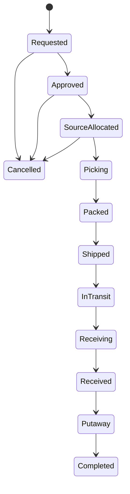

# Transfer Model

> Warehouse A → Warehouse B transferi **tek bir stok hareketi DEĞİLDİR**; saatler/günler süren,
> birden fazla depo ve modülü kateden açık bir business process'tir. Sahibi **Transfers** modülüdür.

## Varlıklar (Network scope)

```text
transfers.transfer_order
  id, code, status
  source_warehouse_id, destination_warehouse_id
  requested_at, approved_at, shipped_at, received_at, completed_at
  created_by, approved_by

transfers.transfer_line
  id, transfer_order_id, sku_id
  requested_qty          CHECK (requested_qty > 0)
  allocated_qty          CHECK (0 <= allocated_qty <= requested_qty)
  shipped_qty            CHECK (0 <= shipped_qty <= allocated_qty)
  received_qty           CHECK (received_qty >= 0)  → üst sınır DOMAIN kuralı (bkz. Discrepancy)
  variance_qty           → çözülen uyuşmazlık (ileride; MVP'de hep 0, bkz. Discrepancy)

transfers.transfer_event   → zaman çizelgesi (UI timeline + audit + sorun takibi)
  transfer_order_id, state, occurred_at, actor_id, note
```

> Satır miktarları transfer workflow'unun **ilerleme göstergesidir**; allocation state'inin
> kopyası DEĞİLDİR. Allocation truth'u Inventory'nin `inventory_reservation`'ındadır —
> Transfers, reservation id'yi referanslar (ADR-0006).

> `received_qty` üzerinde `<= shipped_qty` DB CHECK'i **bilinçli olarak YOKTUR**:
> over receipt / discrepancy akışları ileride schema migration'ı GEREKTİRMEDEN eklenebilsin.
> MVP'de kural domain'de uygulanır: **exact receipt** (received == shipped) dışında tamamlama yok.

**InTransit pozisyonu** saklanan bir kolon değildir; her satır için türetilir:

```text
InTransit = shipped_qty − received_qty − variance_qty
            (MVP'de variance_qty = 0 → InTransit = shipped − received)
```

Network görünümü bu türetilmiş değeri Transfers'tan okur (bkz. [INVENTORY_MODEL.md](INVENTORY_MODEL.md)).

## Yaşam Döngüsü (State Machine — ADR-0004)



Kurallar:

- Geçişler **explicit**dir; tablodaki okun dışında geçiş → `InvalidTransferTransition` hatası.
- `Cancelled`: yalnızca `Shipped` öncesinde izinli; `SourceAllocated`'dan iptalde önce
  kaynak depodaki allocation serbest bırakılır (release). Cancel'da shipped=0 → InTransit=0.
- `Shipped` sonrası iptal YOKTUR; sorunlar "arrival discrepancy" akışına girer (aşağıda).
- Her state değişimi `transfer_event` satırı üretir (UI timeline için).
- **Terminal kuralı:** `status ∈ {Completed, Cancelled}` ⇒ **InTransit = 0**.
  MVP bunu exact receipt ile garanti eder; ileride discrepancy resolution ile kapatılır.

## Stok Muhasebesi (A → InTransit → B)

Örnek: A=1000, B=100, 200 adetlik transfer (MVP: exact receipt).

| Adım | A OnHand | A Allocated (transfer) | InTransit (Transfers) | B OnHand | Transfer-İz Toplamı* |
|---|---|---|---|---|---|
| Başlangıç | 1000 | 0 | 0 | 100 | **1100** |
| 1. SourceAllocated | 1000 | 200 | 0 | 100 | **1100** |
| 2. Shipped (`TransferOut`) | 800 | 0 (tüketildi) | 200 | 100 | **1100** |
| 3. Received (`TransferIn`) | 800 | 0 | 0 | 300 | **1100** |

\* **Transfer-İz Toplamı** = Σ OnHand (depolar) + Σ InTransit — yalnızca transfer lifecycle'ı
kapsamında izlenir.

## Invariant'ın Kesin Tanımı (daraltılmış)

> **Transfer-op nötrlüğü:** Transfer işlemleri (allocate/ship/receive adımları) stokun
> **konumunu** değiştirir, toplamını değiştirmez. Bir transferin kendi muhasebesi içinde
> sistem geneli stok toplamına net etki her adımda 0'dır.

Bu **global inventory invariant DEĞİLDİR**:

- Receiving (tedarikçi girişi), customer shipment, damage, adjustment, disposal →
  network toplamını **meşru olarak değiştirir**.
- Transfer başka bir işlemle (örn. hasar) kesişirse toplam yine değişir — nötrlük yalnızca
  transferin kendi adımları için geçerlidir.

Test: **yalnız transfer adımları** uygulandığında transfer-iz toplamı sabit kalır
(ROADMAP Phase 12 acceptance senaryosu).

## Discrepancy Stratejisi (MVP dışı — model engellemez)

MVP'de gelişmiş discrepancy workflow YOKTUR; kural basittir: `received == shipped` değilse
transfer `Receiving` state'inde kalır ve **problemli transferler** listesinde görünür
(anomali görünürlüğü — bkz. [CONSISTENCY.md](CONSISTENCY.md)). Model ileride şunları
schema değişikliği olmadan destekler:

| Senaryo | Gelecekteki çözüm | InTransit kapanışı | Network etkisi |
|---|---|---|---|
| Short receipt (shipped=100, received=93) | Discrepancy resolution: `variance_qty=7` + reason (miscount) | `7` yazılarak InTransit→0 | −7 (bilinçli, kayıtlı, görünür) |
| Lost in transit (kalan 7 kayıp) | `variance_qty=7` + reason=LOST | →0 | −7, carrier/claim kaydı |
| Damaged in transit (kalan 7 hasarlı) | Hedef depoya **DAMAGED** kovasında `TransferIn` (7) | →0 | Toplam korunur; kova değişir |
| Over receipt (received > shipped) | Aşan kısım ayrı adjustment + discrepancy kaydı (overage) | InTransit alt sınıra 0'a kilitli | +fark, kayıtlı |
| Reconciliation | Periyodik uzlaşma + manuel resolution komutu | eksik kalan pozisyon kapatılır | — |

**Kapanış kuralı (genel):** `InTransit = shipped − received − variance` formülüyle,
terminal state'e geçiş **ancak** InTransit = 0 olduğunda mümkündür; aksi halde transfer
açık pozisyon olarak problem listesinde yaşar. Bu sayede "ortada kaybolmuş stok" hiçbir
zaman sessizce buharlaşmaz.

## Akış: Hangi Modül Ne Yapar

```mermaid
sequenceDiagram
    participant TRF as Transfers
    participant OUT as Outbound (kaynak depo)
    participant INV as Inventory (kaynak)
    participant INB as Inbound (hedef depo)
    participant INV2 as Inventory (hedef)

    TRF->>OUT: IOutboundContract.BeginTransferShipment(transferId)
    OUT->>INV: Allocate talebi (Inventory location seçer, reservation döner)
    INV-->>OUT: reservation id
    OUT->>TRF: olay: Picked → Packed → Shipped
    TRF->>TRF: shipped_qty kaydet (TransferOut Inventory'den Outbound üzerinden uygulanır)
    Note over TRF: InTransit = shipped − received
    TRF->>INB: IInboundContract.BeginTransferReceiving(transferId)
    INB->>INV2: TransferIn (receiving location'a, AVAILABLE veya QUARANTINE)
    TRF->>TRF: received_qty güncelle; exact match → Putaway'a ilerle
```

- **Transfers stok mutate ETMEZ.** Kaynak tarafta Outbound, hedef tarafta Inbound kontratları
  Inventory'yi hareket ettirir. Transfers orchestration + kendi state'ine sahiptir.
- Kaynak depo sevkiyatı Outbound'un **shipment** altyapısını kullanır (pick/pack/load);
  hedef taraf Inbound'un **receiving** altyapısını kullanır (ASN → varış → putaway).
  Böylece aynı operasyon becerisi normal giriş/çıkışla paylaşılır — kopya akış kodlanmaz.

## Consistency (neden distributed transaction yok?)

Fiziksel transfer saatler/günler sürer; iki depoyu kapsayan bir DB transaction'ı açmak
**anlamsız ve zararlıdır**. Doğası gereği **eventually consistent workflow**:

- Her adım kendi transaction'ında tutarlıdır (örn. Shipped: transfer state + TransferOut +
  outbox event aynı tx'de).
- İki depo arasındaki "ortada stok" problemi InTransit pozisyonuyla açıkça modellenir —
  stok hiçbir an "kayıp" sayılmaz, her an bir sahibi vardır.
- Bugün tek DB olsa bile kontrat sınırları dağıtık hale gelebilecek şekilde tutulur
  (ADR-0004). Detaylar: [CONSISTENCY.md](CONSISTENCY.md).

## Idempotency & İzlenebilirlik

- Her adım `(reference_type, reference_id, line_no)` idempotency anahtarıyla çalışır;
  aynı adım iki kez uygulanamaz (ledger UNIQUE + transfer_event UNIQUE).
- Tüm adımlarda `TransferId + CorrelationId + EventId` log'lara taşınır — bir transferin
  tüm izi correlation ID ile bulunabilir.

## Sınırlar (MVP dışı — bilinçli)

- Discrepancy resolution akışı (yukarıda) MVP'de implement edilmez; model engellemez.
- Transfer iptali yalnızca ship öncesi; iade (return transfer) ayrı transfer olarak açılır.
- Carrier entegrasyonu ile otomatik InTransit güncellemesi → Phase 13 (Event Integration).
